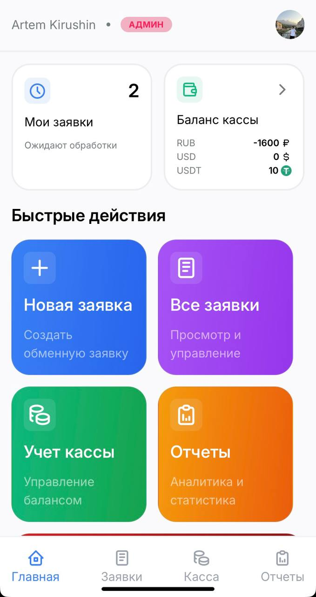
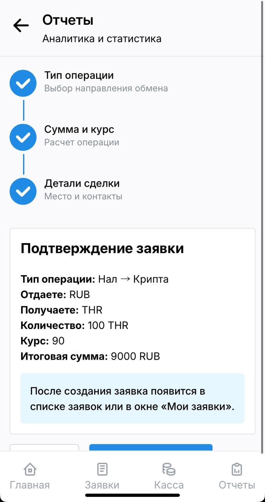
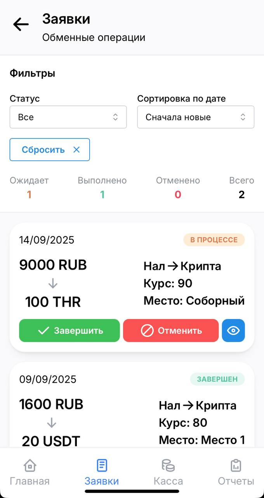
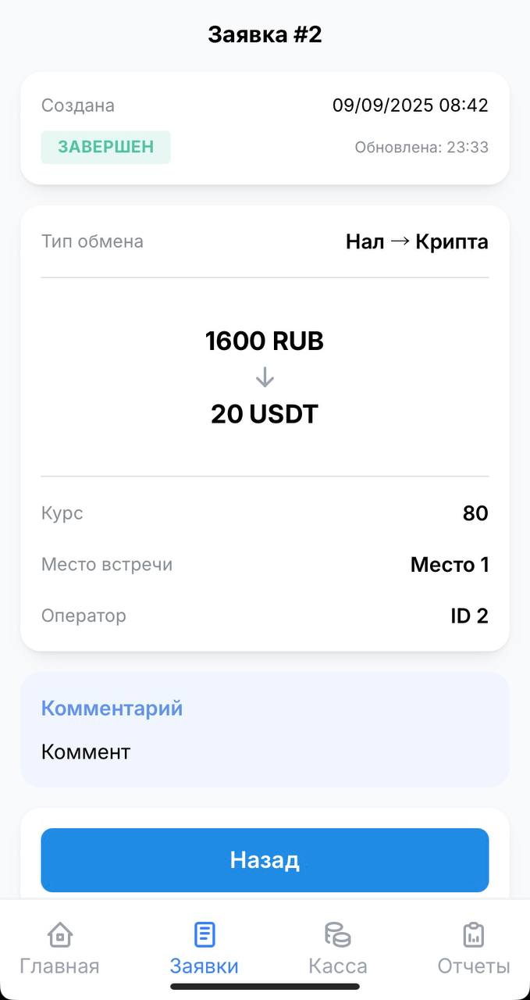
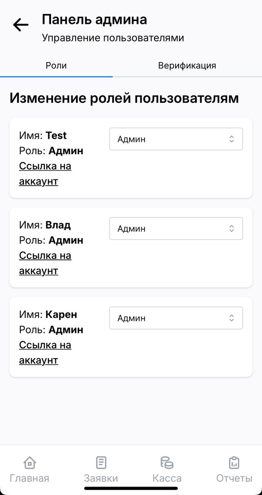
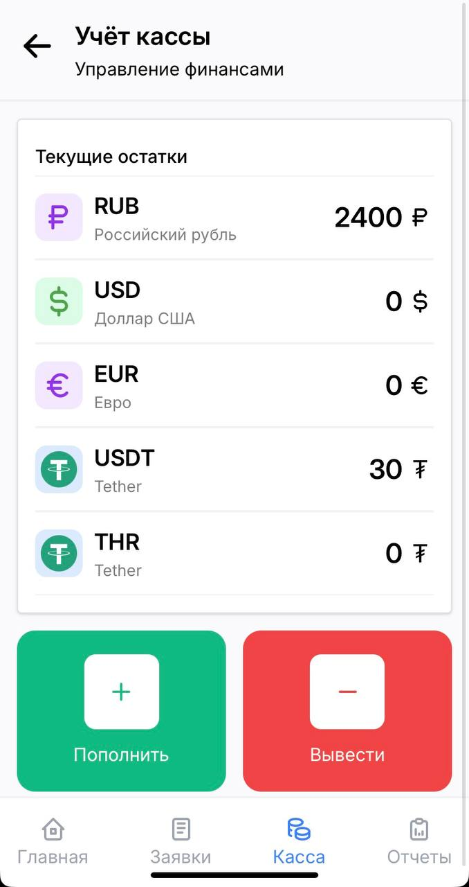

# CRM Trader

Коммерческий проект, реализующий CRM telegram mini app, для управления криптообменником

## ✨ Функционал

- **Аутентификация**

  - Регистрация и авторизация используя уникальный ID телеграмма
  - Проверка на наличие доступа с каждым запросом

- **Заявки**

  - Создание обменных заявок нескольких типов
  - Просмотр в удобной ленте

- **Касса**

  - Управление кассой и быстрый просмотр средств

- **Отчеты**

  - Создание и редактирование Google таблиц для создания отчетности
  - Возможность создания отчетов по нужным датам и темам

- **Админ панель**

  - Быстрое управление пользователями, предоставление и ограничение доступа
  - Возможность изменения ролей с разными возможностями

## 🛠 Cтек

- **Frontend**

  - React + TypeScript
  - MantineUI
  - Zustand
  - TelegramApiSDK
  - React Router

- **Backend**

  - NestJS
  - PostgreSQL
  - Docker

- **CI/CD**
  - GitHub Actions

## 📷 Скриншоты

  
  
  
  
  
  

